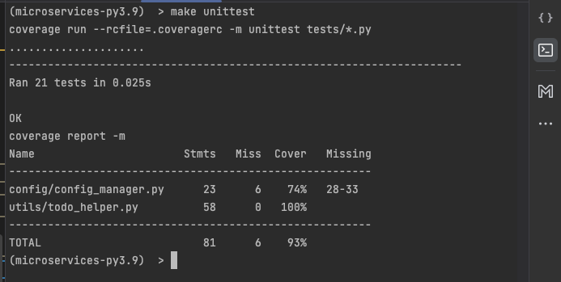
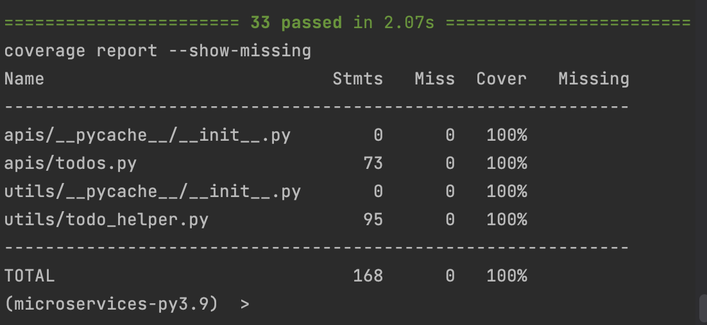

# Building microservices using FastAPI 

Create an API tutorial ( mimic ) https://www.eviltester.com/page/tools/apichallenges/ 
using Python and FastAPI 

## Other Learning Objectives

1. Pytest
2. Unit Test coverage
3. Poetry
4. Fire

## Additional learnings
1. Pytantic
2. Make File

### Spend one hour daily on this project

# Progress
<details>
    <summary>Day 1 : Aug 18  </summary>

`Time Spent : 50 minutes`

- Basic project structure
- Explored and implemented `Makefile`
- Basic understanding of `Poetry`
- Setup `sample_endpoint.py` and test file for it to configure pytest and test coverage

### References 
- https://www.youtube.com/watch?v=YB-_FsssK8E
- https://python-poetry.org/docs/basic-usage/
- https://www.gnu.org/software/make/manual/make.html

</details>


<details> 
    <summary> Day 2: Aug 19</summary>

`Time Spent : 50 minutes`


- :thumbsup: Set up route and todo route that returns  hardcoded value
- :thumbsdown: Unable to have the todo route as a separate module from main


</details>


<details> 
    <summary> Day 3: Aug 21</summary>

`Time Spent : 50 minutes`

- Pydantic
    For GET request
- Async function 
- Pagination and per page

</details>

<details> 
    <summary> Day 4: Aug 22</summary>

`Time Spent : 50 minutes`

- Validation for page and per_page
- Unitest - statuscode done
- :thumbsdown: Unitest - content unable to do 
</details>

<details> 
    <summary> Day 5: Aug 24</summary>

- :thumbsup: Unitest Content done
- :thumbsup: Able to have the todo route as a separate module from main

Reference : https://www.youtube.com/watch?v=sBVb4IB3O_U

`Time Spent : 45 minutes`

</details>


<details> 
    <summary> Day 6: Aug 25</summary>

`Time Spent : 45 minutes`

:thumbsdown: tried to restructure data, reading from a json file and parsing.
Learned the problems of circular import, could not find the right solution but learnt why it is not working
Also, learn to rebase to last working version

This will undo any changes you've made to tracked files and restore deleted files:
```commandline
git reset HEAD --hard
```
This will delete any new files that were added since the last commit:
```commandline
git clean -fd
```
Files that are not tracked due to .gitignore are preserved; they will not be removed
Warning: using -x instead of -fd would delete ignored files. You probably don't want to do this.

Reference : [stack-overflow](https://stackoverflow.com/questions/4630312/reset-all-changes-after-last-commit-in-git)

</details>

<details> 
    <summary> Day 7: Aug 26</summary>

`Time Spent : 90 minutes`

- created helper file to read and save data to json file
- UUID generated 
- stuck with absolute path issue.
- Unit test is not working - need to use mock


_Added a step in Make file to test and push to git_

</details>

<details> 
    <summary> Day 8: Aug 27</summary>

`Time Spent : 45 minutes`

- Route to read an item using id
- Route to remove an item using id 

</details>

<details> 
    <summary> Day 9: Aug 28</summary>

- Route for update using PUT
- Learnt about limitation in FastAPI pydantic base model 
- This is the most complex so for. 

`Time Spent : 75 minutes`

</details>

<details> 
    <summary> Day 10: Aug 29</summary>

- No progress 
- Poetry env got screwed up while adding unit test (not sure about the root cause)
- Fixed the issue
- Then git screwed because of POSTMAN json directly updating remote and me add some __init__.py file

[solution](https://stackoverflow.com/questions/37145151/how-to-handle-git-gc-fatal-bad-object-refs-remotes-origin-head-error)

Have to focus on unit tests tomorrow.

`Time Spent : 90 minutes`

</details>

<details> 
    <summary> Day 11: Aug 30 </summary>

`Time Spent : 120 minutes`

- Productive time creating unit tests and coverage report 
- Config file added using `Singleton` design pattern



</details>

<details> 
    <summary> Day 12: Aug 31</summary>

`Time Spent : 120 minutes`

- unit tests for get_todo_details made to refactor the function.
- unit tests for get_todo_details is complete
- Did @mock at module level.
- Unit test for save_list

</details>


<details> 
    <summary> Day 13: Sep 01 </summary>

`Time Spent : 70 minutes`

- Refactored update list
- Added unit tests for update list and UUID generation 

</details>

<details> 
    <summary> Day 14: Sep 02</summary>

`Time Spent : 240 minutes`

- Lot of experimentation to mock the end points.
- Finally, found that mocking should happen function call inside the route not at the actual function definition
- Completed unittests for two routes.
- All functions and routes have unit tests now.
- Overall it was a great learning write isolated unittest mocking every external calls.

</details>

<details> 
    <summary> Day 15: Sep 03</summary>

`Time Spent : 240 minutes`

- Debug log added for all functions
- Again `Singleton pattern` used to invoke error config
- Some refactoring while adding debug log
- Learnt about --show-missing in coverage to show missing lines 



</details>

<details> 
    <summary> Day 16: Sep 04</summary>

`Time Spent : 120 minutes`

- No new functionality added.
- Appropriate 404 and 500 exception returned 
- Unit tests refactored as per the changes.
- Fixed "PUT - Handle updating an existing todo item with empty body {}" - Good learning about Pytantic

</details>

<details> 
    <summary> Day 17: Sep 05 </summary>

`Time Spent : 180 minutes`

- Added integration tests for all 200 status code
- Added integration tests for 4xx status code 
  - Resulted in some logic change
  - Unit test updated 
- Bug fixes

</details>


<details> 
    <summary> Day 18: Sep 06</summary>

`Time Spent : 150 minutes`

- Some more restructuring of code. 
- removed absolute paths
- Dockerfile and dockerignore added
- Docker image ready
- :thumbsdown: Port mapping. Still the endpoints are not exposed to outside world

</details>

<details> 
    <summary> Day 18: Sep 07</summary>

`Time Spent : 60 minutes`

- Port mapping. Still the endpoints are not exposed to outside world.
- Uploaded docker image - https://hub.docker.com/r/dhanasekars/my-todos/tags 

</details>


<details> 
    <summary> Day 18: Sep 07</summary>

`Time Spent : 120 minutes`

- Setting up Git up actions
- Failing in tests, not able to find the config file path.
- Should be config issue. Need to explore tomorrow

</details>


<details> 
    <summary> Day 18: Sep 08</summary>

`Time Spent : 120 minutes`

- Gitactions complete - building code and pushing to docker hub

</details>

-------------------------------

<details> 
    <summary> Day 0: Template</summary>

`Time Spent : XX minutes`

</details>